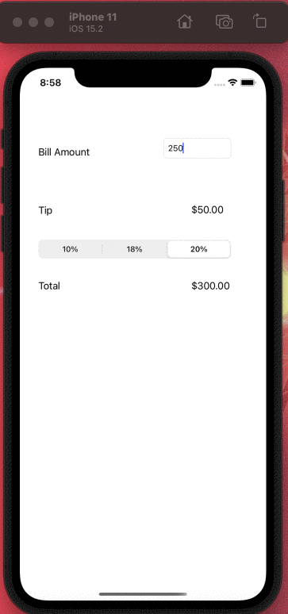

# Pre-work - Tip Calculator App*

**Name of your app** is a tip calculator application for iOS.

Submitted by: **Sai Varma Penmatsa**

Time spent: **2.5 hours** hours spent in total

## User Stories

The following **required** functionality is complete:

* [x] User can enter a bill amount, choose a tip percentage, and see the tip and total values.
* [x] User can select between tip percentages by tapping different values on the segmented control and the tip value is updated accordingly

